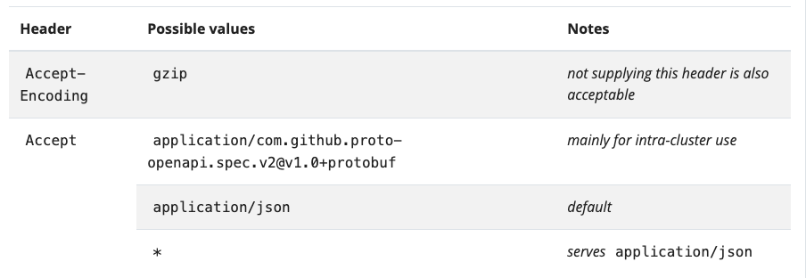

# The Kubernetes API
K8s control plane 的核心是 API server。API server 暴露的 HTTP API 让你的终端用户， 集群的其他部分，以及外部的组件彼此进行通信。

K8s API 能够让你查询和操作K8s中API 对象的状态(例如：Pods, Namespace, ConfigMaps, Events)

大部分操作执行可以通过 kubectl 命令行工具或者其他命令行工具，例如 kubeadm, 它将调用 API。然而，你也可以直接通过 REST 请求调用接口。

如果你正在编写的应用程序正在使用 K8s API, 可以考虑使用其中一个[客户端库](https://kubernetes.io/docs/reference/using-api/client-libraries/)

## OpenAPI 说明书
完整的API细节被记录在[OpenAPI](https://www.openapis.org/)

Kubernetes API 服务器提供一个OpenAPI 规范利用 /openapi/v2 端点。你可以使用如下的请求头来获取请求响应。

K8s 实现了一个可选的基于 Protobuf 的序列化格式，主要用于内存通信。更多信息关于该格式，请查看[Kubernetes Protobuf serialization](https://github.com/kubernetes/community/blob/master/contributors/design-proposals/api-machinery/protobuf.md) 设计建议和接口定义语言(IDL)文件，用于定义API对象的Go包中的每个架构。

## 持久化
K8s 将对象序列化数据数据存在 etcd

## API groups and versioning
为了更轻松地消除字段或重组资源标示形式，K8s 支持多种 API 版本，每个版本有不同的 API 路径，例如 /api/v1 或者 /apis/rbac.authorization.k8s.io/v1alpha1

版本控制是在API级别完成的，而不是在资源或字段级别，以确保API提供了一个清晰的，一致的视图系统资源和行为。

为了方便触发和扩展API，K8s实现了 API groups来实现允许和禁止。

API资源通过其API group, 资源类型，名称空间(用于命名空间的资源)和名称来区分。API服务器透明地处理PAI版本之间的转换：所有不同的版本实际代表相同的持久化数据。API server 可能使用不同版本的 API 来服务相同的底层数据。

举个例子，同时支持两种 API 版本，v1 和 v1beta1来获取相同的资源。如果你起先使用 v1beta1 版本的API创建对象，那么之后你可以通过 v1beta1 或者 v1 API 都可以读取，更新和删除对象。

### API changes
任何成功的系统都需要成长和改变当新的或现有的用例出现变化。因此，K8s 已经将 K8s API 设计为持续的改变和成长。K8s 项目的目标是兼容已存在的客户端做兼容性，同时为了维护一定时间的兼容性，因此让其他项目有机会来适配。

总的来说，新的API 资源和新的资源字段被添加是频繁的。消除资源或字段需要符合[策略](https://kubernetes.io/docs/reference/using-api/deprecation-policy/)

一旦K8s API 达到了 GA, K8s 制定了一个承诺维护官方 Kubernetes API 的兼容性, 通常在 v1 API 版本。此外，在可行的情况下，K8s 甚至可以保持 Beta API 版本的兼容性：如果你适配了 beta API, 你可以继续使用该API和集群进行交互，甚至可以保持到该特性变得稳定。

### API 扩展性
Kubernetes API 可以通过以下两种方式之一进行扩展：
1. 通过自定义资源，您可以声明性的定义API服务器应如何提供所选资源的API

2. 你可以通过实现 [aggregation layer](https://kubernetes.io/docs/concepts/extend-kubernetes/api-extension/apiserver-aggregation/) 来扩展 Kubernetes API。
