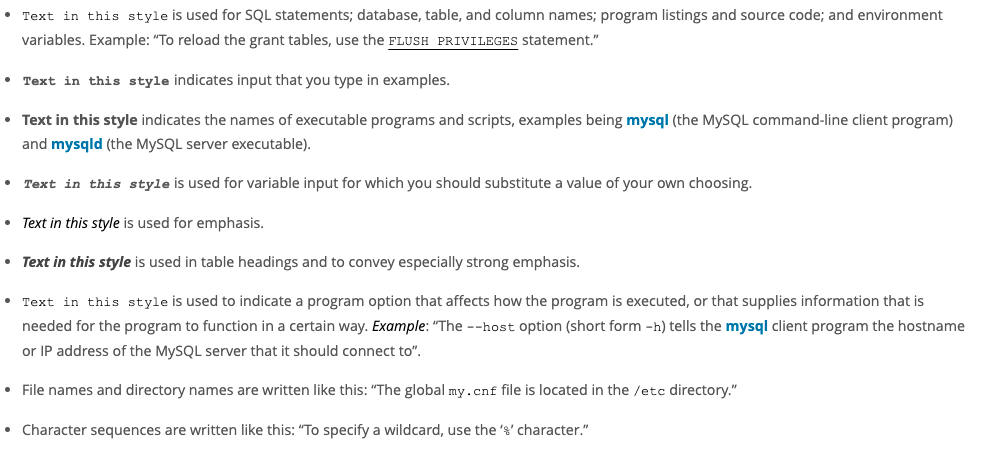

# 关于这篇手册

这个参考手册适用于 MySQL 数据库系统的 5.7版本到 5.7.35 版本。MySQL 5.7 的不同小版本之间的差异被记录在已存在各个发行版(5.7.x)的 text 文本中。更多的协议信息，请看[法律注意事项](https://dev.mysql.com/doc/refman/5.7/en/preface.html#legalnotice)

这个参考手册不适用于之前老的 MySQL 版本，因为之前的版本和 5.7 版本之间的功能和函数有很大的差异，故 5.7 版本是一个大版本升级，不兼容之前的版本。如果你使用的是 MySQL 之前的发行版，那么请参考合适的手册

如果你使用的是 MySQL 8.0, 请参考 [MySQL 8.0](https://dev.mysql.com/doc/refman/8.0/en/)

因为这边手册用于参考，所以并没有提供 SQL 或者关系型数据概念的通用指令。所以也不会教你如何使用操作系统或者命令行解释器。

因为 MySQL 数据库软件依然在不断的发展，所以这个参考手册同样也更新的非常频繁。这个可以最新使用的手册可以在线搜索[https://dev.mysql.com/doc/.](https://dev.mysql.com/doc/) 搜索获取。其他的格式同样可以在这里获取，包括可下载的 HTML格式和 PDF 版本。

如果你有关于 MySQL 的任何问题，加入 [MySQL Community Slack](https://mysqlcommunity.slack.com/), 或者在论坛访问，[参考社区论坛](https://dev.mysql.com/doc/refman/5.7/en/information-sources.html#forums)。如果你对参考手册有什么建议或者意见，请发送建议到 [http://www.mysql.com/company/contact/](http://www.mysql.com/company/contact/)

# 印刷和语法规范

这个参考手册使用一系列的印刷约定：
